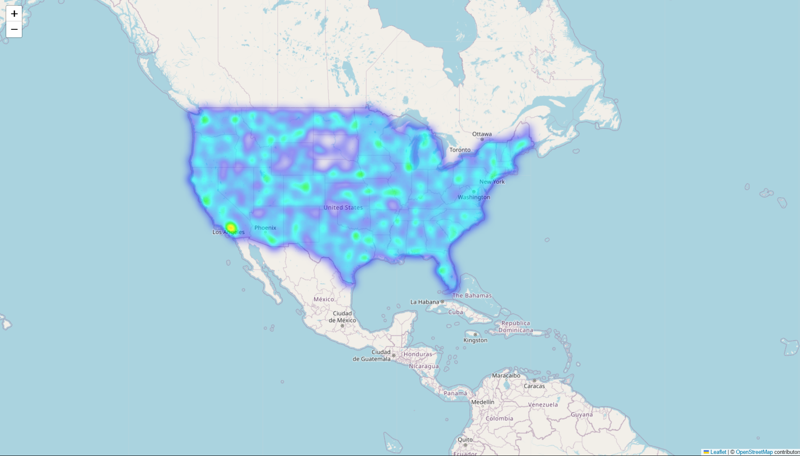
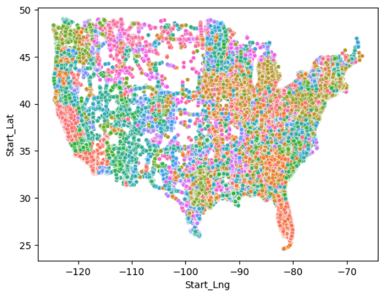

# Predicting Accident Severity using Machine Learning

This project analyzes the US Road Accidents dataset and uses machine learning techniques to predict the severity of traffic accidents. By leveraging this dataset, the goal is to build reliable models, gain insights into contributing factors, and propose strategies to enhance road safety.

# Dataset Description

The dataset contains extensive details of road accidents that occurred in the United States, including features like weather conditions, road types, time of day, and more.

| #   | Attribute             | Description                                                                                                        | Nullable |
|-----|-----------------------|--------------------------------------------------------------------------------------------------------------------|----------|
| 1   | ID                    | Unique identifier of the accident record.                                                                          | No       |
| 2   | Severity              | Accident severity (1 = least impact, 4 = significant impact).                                                     | No       |
| 3   | Start_Time            | Start time of the accident in local time zone.                                                                     | No       |
| 4   | End_Time              | End time of the accident (when traffic impact was dismissed).                                                      | No       |
| 5   | Start_Lat             | Latitude (GPS coordinate) of the start point.                                                                      | No       |
| 6   | Start_Lng             | Longitude (GPS coordinate) of the start point.                                                                     | No       |
| 7   | End_Lat               | Latitude (GPS coordinate) of the end point.                                                                        | Yes      |
| 8   | End_Lng               | Longitude (GPS coordinate) of the end point.                                                                       | Yes      |
| 9   | Distance(mi)          | Length of road extent affected by the accident.                                                                    | No       |
| 10  | Description           | Natural language description of the accident.                                                                      | No       |
| 11  | Number                | Street number in the address field.                                                                                | Yes      |
| 12  | Street                | Street name in the address field.                                                                                  | Yes      |
| 13  | Side                  | Relative side of the street (Right/Left) in the address field.                                                     | Yes      |
| 14  | City                  | City in the address field.                                                                                         | Yes      |
| 15  | County                | County in the address field.                                                                                       | Yes      |
| 16  | State                 | State in the address field.                                                                                        | Yes      |
| 17  | Zipcode               | Zipcode in the address field.                                                                                      | Yes      |
| 18  | Country               | Country in the address field.                                                                                      | Yes      |
| 19  | Timezone              | Timezone based on the accident location.                                                                           | Yes      |
| 20  | Airport_Code          | Closest airport-based weather station to the accident location.                                                    | Yes      |
| 21  | Weather_Timestamp     | Timestamp of the weather observation (local time).                                                                 | Yes      |
| 22  | Temperature(F)        | Temperature (in Fahrenheit).                                                                                       | Yes      |
| 23  | Wind_Chill(F)         | Wind chill (in Fahrenheit).                                                                                        | Yes      |
| 24  | Humidity(%)           | Humidity (in percentage).                                                                                          | Yes      |
| 25  | Pressure(in)          | Air pressure (in inches).                                                                                          | Yes      |
| 26  | Visibility(mi)        | Visibility (in miles).                                                                                             | Yes      |
| 27  | Wind_Direction        | Wind direction.                                                                                                    | Yes      |
| 28  | Wind_Speed(mph)       | Wind speed (in miles per hour).                                                                                    | Yes      |
| 29  | Precipitation(in)     | Precipitation amount (in inches).                                                                                  | Yes      |
| 30  | Weather_Condition     | Weather condition (rain, snow, thunderstorm, fog, etc.).                                                           | Yes      |
| 31  | Amenity               | Indicates presence of an amenity near the accident location.                                                       | No       |
| 32  | Bump                  | Indicates presence of a speed bump or hump near the accident location.                                             | No       |
| 33  | Crossing              | Indicates presence of a crossing near the accident location.                                                       | No       |
| 34  | Give_Way              | Indicates presence of a "give way" sign near the accident location.                                                | No       |
| 35  | Junction              | Indicates presence of a junction near the accident location.                                                       | No       |
| 36  | No_Exit               | Indicates presence of a "no exit" sign near the accident location.                                                 | No       |
| 37  | Railway               | Indicates presence of a railway near the accident location.                                                        | No       |
| 38  | Roundabout            | Indicates presence of a roundabout near the accident location.                                                     | No       |
| 39  | Station               | Indicates presence of a station near the accident location.                                                        | No       |
| 40  | Stop                  | Indicates presence of a stop sign near the accident location.                                                      | No       |
| 41  | Traffic_Calming       | Indicates presence of traffic calming measures near the accident location.                                         | No       |
| 42  | Traffic_Signal        | Indicates presence of a traffic signal near the accident location.                                                 | No       |
| 43  | Turning_Loop          | Indicates presence of a turning loop near the accident location.                                                   | No       |
| 44  | Sunrise_Sunset        | Period of the day (day or night) based on sunrise/sunset.                                                          | Yes      |
| 45  | Civil_Twilight        | Period of the day (day or night) based on civil twilight.                                                          | Yes      |
| 46  | Nautical_Twilight     | Period of the day (day or night) based on nautical twilight.                                                       | Yes      |
| 47  | Astronomical_Twilight | Period of the day (day or night) based on astronomical twilight.                                                   | Yes      |

Target Variable: Accident Severity (1 to 3).

# Methodology

  # 1. Data Preprocessing:

      Data Cleaning:

      Handled missing values and outliers.

      Encoded categorical variables using one-hot encoding.

      Scaled numerical features.

      Feature Engineering:

            Created new features such as time-based categories (e.g., rush hours).

            Assessed feature importance for model optimization.

  # 2. Data Splitting:

      Training Set: 75%

      Validation Set: 15%

      Test Set: 10%

  # 3. Model Training:

      The following algorithms were implemented and evaluated:

                Logistic Regression: Achieved a maximum accuracy of 75%.

                K-Nearest Neighbors (KNN): Accuracy reached 74%.

                Decision Trees: Moderately accurate with potential overfitting.

                Random Forest: Performed similarly to Logistic Regression with an accuracy of 75%.

# Results

| Model                  | Accuracy |
|------------------------|----------|
| Logistic Regression    | 75%      |
| K-Nearest Neighbors    | 74%      |
| Decision Trees         | 73%      |
| Random Forest          | 75%      |

# Traffic Accident Data Visualizations

## Heatmap of Accidents
This heatmap shows the density of road accidents across the United States:

## County-Wise Accident Clustering
This scatter plot shows the spatial distribution of accidents categorized by counties:

# Key Findings:

    Logistic Regression and Random Forest are the best-performing models, each achieving 75% accuracy.

    Accident severity prediction depends significantly on weather, road conditions, and time of day.

    Feature engineering (e.g., creating time-based categories) helped improve model performance slightly.

# Recommendations

    Feature Refinement: Use advanced feature selection techniques or domain knowledge to uncover more influential predictors.

    Data Augmentation: Incorporate external datasets like real-time traffic or weather data for improved predictions.

    Mitigation Strategies:

          Enhance road infrastructure in high-accident areas.

          Adjust traffic rules during bad weather or high-risk times.

[Watch Video](https://www.loom.com/share/386e8be0810240179da5337babad2ba8?sid=8f3b1af8-70c1-43be-9cbb-9c58b92157f6)

